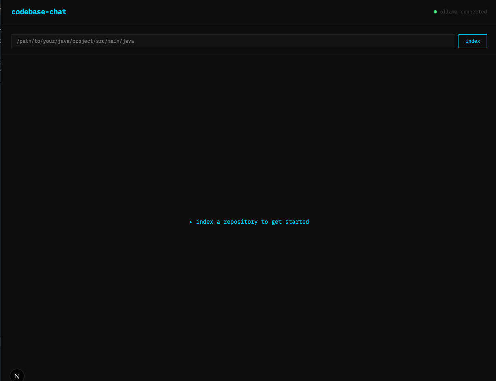
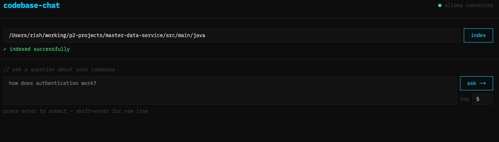
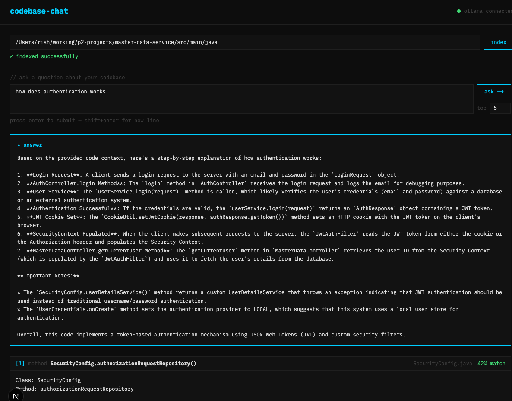

# codebase-chat

> Ask natural language questions about your Java codebase and get answers grounded in your actual source code — not generic LLM responses.

No cloud APIs. No subscriptions. Runs entirely on local hardware.


java 21 · python 3.11 · spring boot 3.5 · langchain4j · ollama · pgvector · mit
---

## demo

**1. Start the app and enter a Java repository path**



**2. Index the repository — AST parsing + embedding runs in the background**



**3. Ask a natural language question — get an answer grounded in your actual source code**



---

## architecture

```
┌─────────────────────────────────┐
│   React / Next.js 16            │  ← Chat UI (IBM Plex Mono, #00D4FF)
│   TypeScript · Tailwind 4       │
└────────────────┬────────────────┘
                 │ HTTP
┌────────────────▼────────────────┐
│   Spring Boot 3.5 · Java 21     │  ← RAG Orchestration
│   LangChain4j 1.12.2            │
└──────────┬──────────────────────┘
           │                │
    HTTP   │                │ LangChain4j
┌──────────▼──────┐  ┌──────▼──────────┐
│  Python FastAPI │  │  Ollama         │
│  AI Worker      │  │  llama3.1:8b    │
│                 │  │  local LLM      │
│  • javalang AST │  └─────────────────┘
│  • embeddings   │
│  • pgvector     │
└──────────┬──────┘
           │
┌──────────▼──────────────────────┐
│  PostgreSQL 16 + pgvector       │  ← Vector Store
│  cosine similarity search       │
└─────────────────────────────────┘
```

### why polyglot?

Each layer uses the best tool for the job:

- **Python** — `sentence-transformers` and `javalang` AST parsing are mature Python-native libraries with no Java equivalents
- **Java/Spring Boot** — LangChain4j keeps orchestration in the enterprise stack; straightforward to integrate into existing Java systems
- **React/TypeScript** — monospace brutalist UI designed specifically for developer tooling

---

## how it works

### 1. indexing

The Python AI worker walks a Java repository and parses every `.java` file into meaningful chunks using AST analysis — splitting by class and method boundaries, not arbitrary line counts.

Each chunk is enriched with its class and method context before embedding:

```
Class: UserService
Method: login

public AuthResponse login(LoginRequest request) {
    // actual method body — complete, not truncated
}
```

Enriched chunks are converted to 384-dimension vectors using `all-MiniLM-L6-v2` and stored in pgvector.

### 2. retrieval

When a question is asked, it is embedded into the same 384-dimension vector space and pgvector performs cosine similarity search to find the most semantically relevant chunks.

### 3. generation

Retrieved chunks are formatted into a structured Markdown prompt and sent to Ollama with a system instruction to answer only from the provided context — preventing hallucination.

---

## tech stack

| Layer | Technology |
|---|---|
| Frontend | Next.js 16, TypeScript, Tailwind 4, IBM Plex Mono |
| Backend | Spring Boot 3.5, Java 21, LangChain4j 1.12.2 |
| AI Worker | Python 3.11, FastAPI, sentence-transformers |
| LLM | Ollama — llama3.1:8b (local inference) |
| Vector Store | PostgreSQL 16 + pgvector |
| Java Parser | javalang (AST-based chunking) |

---

## prerequisites

- Docker Desktop
- Java 21
- Node.js 20
- Ollama

```bash
ollama pull llama3.1:8b
```

---

## running locally

### 1. start postgres and the AI worker

```bash
cp .env.example .env   # set ALLOWED_BASE_PATHS to the parent directory of your Java repos
docker compose up -d
```

This starts PostgreSQL 16 with pgvector and the Python AI Worker. The database schema and vector indexes are created automatically on first boot via `init.sql`.

### 2. start the backend

```bash
cd backend
cp .env.example .env
./mvnw spring-boot:run
```

### 3. start the frontend

```bash
cd frontend
npm install
cp .env.local.example .env.local
npm run dev
```

Open `http://localhost:3000`

---

## environment variables

### root `.env`

```
DB_NAME=codebase_chat
DB_USER=admin
DB_PASSWORD=admin
AI_WORKER_PORT=8001
ALLOWED_BASE_PATHS=/path/to/your/projects,/tmp
REPO_MOUNT_PATH=/path/to/your/projects
```

### backend `.env`

```
DB_URL=jdbc:postgresql://localhost:5432/codebase_chat
DB_USERNAME=admin
DB_PASSWORD=admin
AI_WORKER_URL=http://localhost:8001
OLLAMA_URL=http://localhost:11434
OLLAMA_MODEL=llama3.1:8b
CORS_ALLOWED_ORIGINS=http://localhost:3000
```

### frontend `.env.local`

```
NEXT_PUBLIC_API_URL=http://localhost:8080
```

---

## usage

1. Enter the absolute path to a Java repository and click **index**
2. Wait for indexing to complete — the chat panel will appear
3. Ask natural language questions about the codebase
4. The AI answer appears above the retrieved source chunks

---

## key design decisions

### AST-based chunking over line splitting
Splitting by class and method boundaries produces semantically complete chunks. A method split across two chunks loses context and degrades retrieval quality significantly.

### Brace-counting for true method boundaries
A brace-counting algorithm finds the real closing `}` of each method rather than using a fixed line window. `getUserById` went from 50 lines of noise to a clean 10-line chunk. Similarity scores improved measurably — `AuthController.login` jumped from 0.34 to **0.44** cosine similarity after this fix.

### Chunk enrichment before embedding
Prefixing each chunk with `Class: X\nMethod: Y` gives the embedding model explicit semantic signal, significantly improving retrieval accuracy for method-level queries.

### Prompt engineering at the data layer
The context is formatted with Markdown `###` headers between chunks — exploiting how LLMs parse section separators from their training data. The system prompt constrains the model to answer only from provided context, preventing hallucination.

### Transaction-safe re-indexing
`TRUNCATE` was replaced with a scoped `DELETE WHERE file_path = ANY(?)` wrapped in a transaction with rollback. If any insert fails, existing data is preserved. This also lays the groundwork for multi-repo support.

### Connection pooling
`ThreadedConnectionPool(min=2, max=10)` replaces raw psycopg2 connections. Connections are borrowed per request and returned in a `finally` block — no connection leaks under concurrent load.

### Security hardening
- Credentials externalized to environment variables with safe fallbacks for local dev
- Path traversal protection on `/index` — allowlist validates repo paths before filesystem access; `os.sep` appended to base paths prevents prefix collision attacks (e.g. `/projects-evil` matching `/projects`)
- CORS restricted from wildcard to configured origin via `CORS_ALLOWED_ORIGINS`
- NPE eliminated in `AiWorkerClient` via null checks and `Optional`
- AI worker errors logged via SLF4J before being swallowed — failures always leave a trace
- Constructor injection throughout — no field injection, fully testable

### Separation of concerns
The Python microservice owns all ML operations. Spring Boot owns orchestration and business logic. The vector store is abstracted behind the Python service — swapping pgvector for Qdrant or Pinecone requires no Java changes.

---

## project structure

```
codebase-chat/
├── .github/
│   └── workflows/
│       └── ci.yml              GitHub Actions — pytest + Maven run in parallel
├── ai-worker/                  Python FastAPI — AST parsing + embeddings
│   ├── app/
│   │   ├── main.py             FastAPI entry point — /index and /query endpoints
│   │   ├── embedder.py         sentence-transformers embedding service
│   │   ├── db.py               pgvector storage, connection pool, cosine search
│   │   └── parser/
│   │       └── java_parser.py  javalang AST chunker — brace-counting boundaries
│   ├── tests/
│   │   ├── test_is_safe_path.py    Path traversal + allowlist tests (8 cases)
│   │   └── test_java_parser.py     Brace-counting chunker tests (8 cases)
│   ├── Dockerfile
│   ├── pytest.ini
│   └── requirements.txt
├── backend/                    Spring Boot — RAG orchestration
│   └── src/
│       ├── main/java/com/cloudrishi/codebasechat/
│       │   ├── controller/
│       │   │   └── ChatController.java     REST endpoints — /api/index, /api/chat
│       │   ├── service/
│       │   │   └── ChatService.java        RAG pipeline — retrieve → augment → generate
│       │   ├── client/
│       │   │   └── AiWorkerClient.java     WebClient — calls Python microservice
│       │   ├── model/
│       │   │   ├── QueryRequest.java
│       │   │   ├── QueryResponse.java
│       │   │   ├── IndexRequest.java
│       │   │   └── CodeChunk.java
│       │   └── config/
│       │       └── OllamaConfig.java       LangChain4j Ollama bean
│       └── test/java/com/cloudrishi/codebasechat/
│           └── client/
│               └── AiWorkerClientTest.java  MockWebServer tests — null guards (9 cases)
├── frontend/                   Next.js — chat UI
│   └── app/
│       ├── components/
│       │   ├── ChatPanel.tsx           Question input + answer display
│       │   ├── ChunkCard.tsx           Retrieved source chunk with similarity score
│       │   ├── Header.tsx              Branding bar
│       │   └── IndexPanel.tsx          Repo path input + index trigger
│       ├── globals.css                 Design tokens — IBM Plex Mono, #00D4FF accent
│       ├── layout.tsx
│       └── page.tsx
├── docs/                       Screenshots
├── docker-compose.yml          Postgres + AI Worker — full local environment
├── init.sql                    pgvector extension, schema, indexes
├── LICENSE
└── README.md
```

---

## code quality

Independently reviewed against Robert Martin, Martin Fowler, Kent Beck, and Ward Cunningham standards.

| Metric | Score | Notes |
|---|---|---|
| Architecture | 8/10 | Clean polyglot separation, constructor injection, good design decisions |
| Clarity and naming | 8/10 | Self-describing methods throughout — `buildContext`, `mapToCodeChunk`, `parse_java_file` |
| Documentation | 9/10 | Full Javadoc, Python docstrings, comprehensive README |
| Single responsibility | 7/10 | Good separation across services; `db.py` mixes connection and query logic |
| Error handling | 7/10 | try/except/finally, transaction rollback, null checks, Optional, SLF4J logging |
| Security | 8/10 | Path traversal protected with prefix-collision fix, CORS restricted, credentials externalized |
| Test coverage | 4/10 | 25 tests across Python and Java layers; integration layer not yet covered |
| Testability | 5/10 | Constructor injection + MockWebServer enables unit testing without live services |
| CI/CD | 7/10 | GitHub Actions runs pytest and Maven in parallel on every push |
| Production readiness | 5/10 | Full local environment via Docker Compose; env profiles and rate limiting still pending |
| **Project average** | **~7/10** | Solid portfolio-grade codebase |

---

## roadmap

- **Hybrid search** — combine pgvector cosine similarity with PostgreSQL full-text search for better recall
- **Integration tests** — test the full RAG pipeline end-to-end against a real pgvector instance
- **Git webhook trigger** — auto re-index on push to main branch
- **Graph view** — visualize class/method relationships in the React frontend
- **Multi-repo support** — index and query multiple repositories simultaneously
- **Token-aware chunking** — enforce 512-token limit per chunk to prevent embedding truncation
- **Dockerize backend** — single `docker compose up` to run the full stack
- **Env profiles** — separate dev/prod configurations with hardened production defaults

---

## author

**cloudrishi** — Senior Backend Engineer / Technical Architect  
20+ years enterprise Java · AI/ML pivot · building in public  
[github.com/cloudrishi](https://github.com/cloudrishi)
